# Centos配置

## 虚拟机安装
1. 所需工具
> CentOS7 iso镜像  
> VMware Workstation  

2. 打开虚拟机新建向导，如图:  
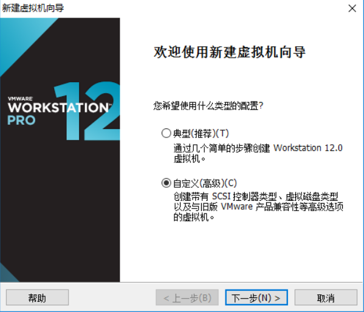
3. 选择稍后安装操作系统，如图:  
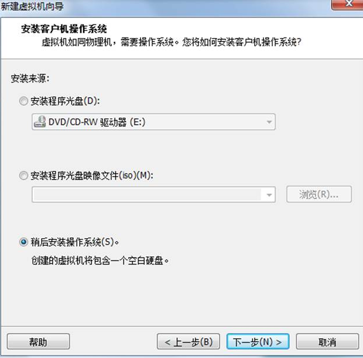
4. 选择Linux操作系统，版本选择CentOS64位，如图:  
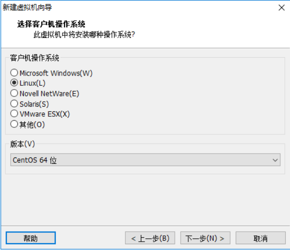  
5. 设置虚拟机名称以及安装位置
6. 选择处理器核心数量，默认选择一核，如图:  
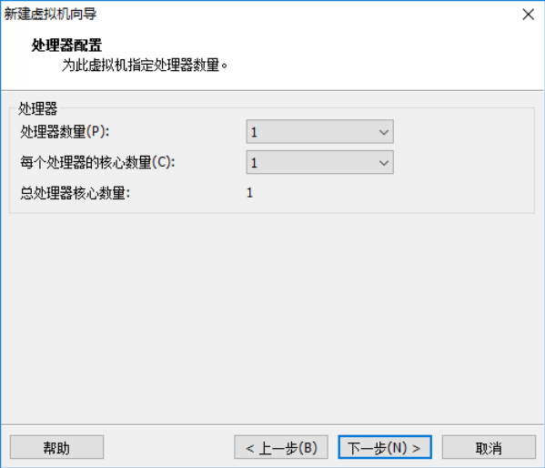  
7. 接下来给虚拟机分配内存，一般1G左右合适，如图:  
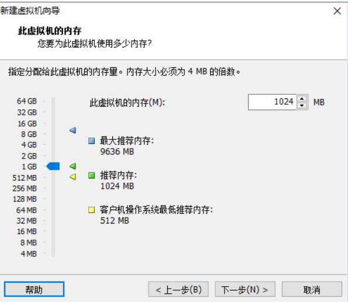  
8. 接下来选择网络类型，选择网络地址转换(NAT)
9. 使用LSI Logic，如图:  
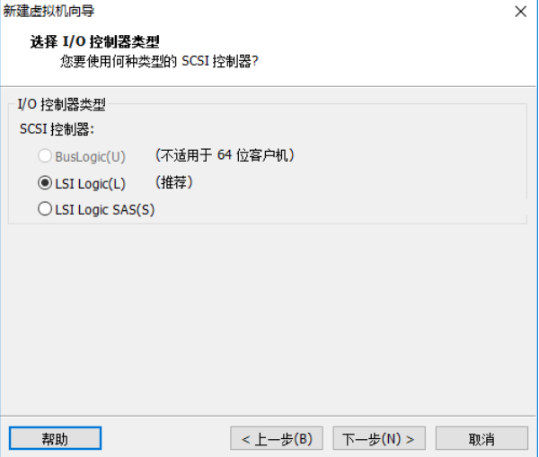  
10. 继续下一步，如图：  
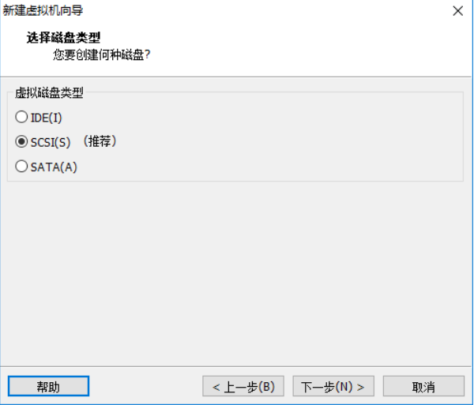  
11. 接下来选择创建一个新的虚拟磁盘， 如图：  
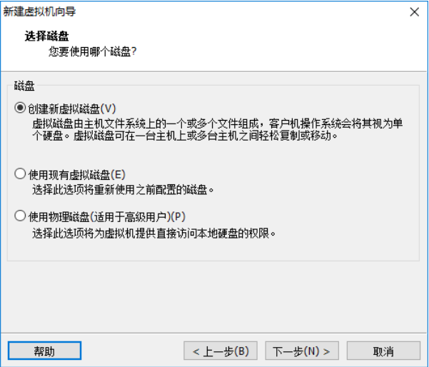
12. 选择最大磁盘大小为20G，其余选项如图：  
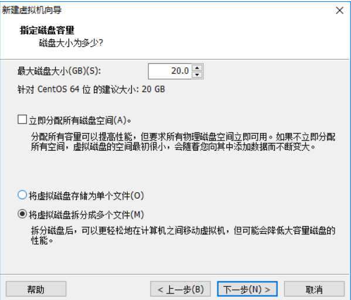
13. 选择磁盘文件存储位置，点击完成，并且开启此虚拟机
14. 安装过程使用的语言环境，选择英文，如图：  
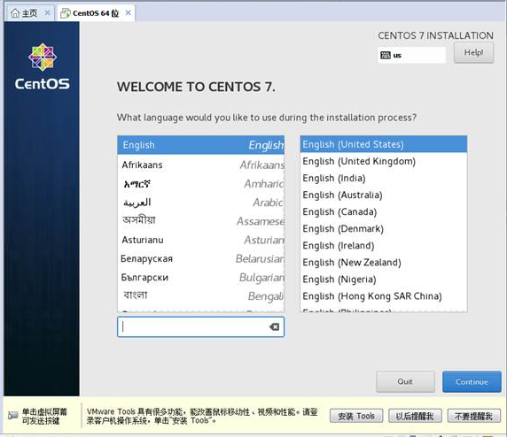
15. 选择最小化安装系统，不安装图像界面，如图：  
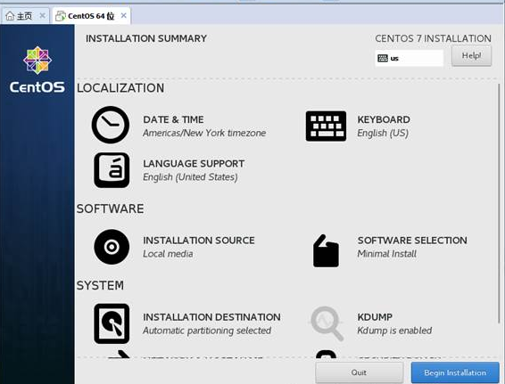
16. 设置root用户以及密码，如图:  
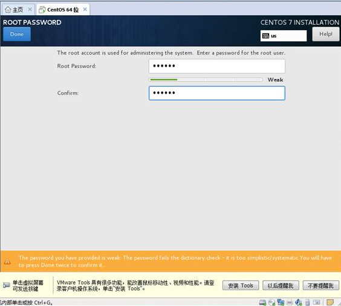
17. 接下来重启系统，完成安装，进入系统。  


## 配置虚拟机网络
2. 修改网卡配置，使用vi /etc/sysconfig/network-scripts/ifcfg-eth0修改为:
	```
# 修改以下配置
$ vi /etc/sysconfig/network-scripts/ifcfg-eth0
ONBOOT=yes 设置为开机后启动
IPADDR=192.168.34.131 #此处设置固定的IP 
GATEWAY=192.168.0.1 #此处设置网关IP 
BOOTPROTO=static #设置为静态
# 修改后
TYPE="Ethernet"
BOOTPROTO="static"
DEFROUTE="yes"
IPV4_FAILURE_FATAL="no"
IPV6INIT="yes"
IPV6_AUTOCONF="yes"
IPV6_DEFROUTE="yes"
IPV6_FAILURE_FATAL="no"
IPV6_ADDR_GEN_MODE="stable-privacy"
NAME="eth0"
UUID="150fc126-a19c-4f82-ae5b-9fa118374f27"
DEVICE="eth0"
ONBOOT="yes"
IPADDR="192.168.34.131"
PREFIX="16"
GATEWAY="192.168.0.1"
DNS1="114.114.114.114"
IPV6_PEERDNS="yes"
IPV6_PEERROUTES="yes"
IPV6_PRIVACY="no"

	```

3. 重启网络服务：
	```
$ service network restart
	```
  
4. 测试网络是否畅通
	```
$ ping www.baidu.com 
	```


## 配置SSH服务  
1. 安装openssh-server
```
# 查看是否安装openssh-server
$ yum list installed | grep openssh-server
openssh-server.x86_64                7.4p1-11.el7                   @anaconda 
# 若未安装，使用
$ yum install openssh-server
```
2. 编辑文件
	```
# 把监听端口、监听地址前的#号去除
$ vi /etc/ssh/sshd_config
Port 22
#AddressFamily any
ListenAddress 0.0.0.0
ListenAddress ::
# 开启允许远程登陆，去除PermitRootLogin的#号
#LoginGraceTime 2m
PermitRootLogin yes
#StrictModes yes
#MaxAuthTries 6
#MaxSessions 10
# 开启使用用户名密码来作为连接验证，去除PasswordActhentication的#
# To disable tunneled clear text passwords, change to no here!
PasswordAuthentication yes
#PermitEmptyPasswords no
PasswordAuthentication yes
	```
6. 开启服务并检查
	```
# 开启服务
$ service sshd start
# 检查是否启动
$ ps -e | grep sshd 
# 检查端口
$ netstat -an | grep 22
	```
