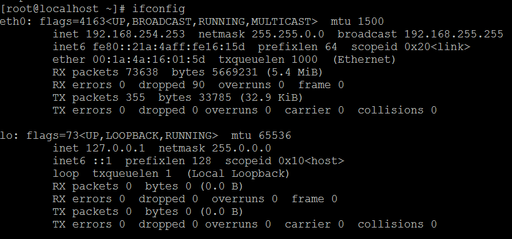
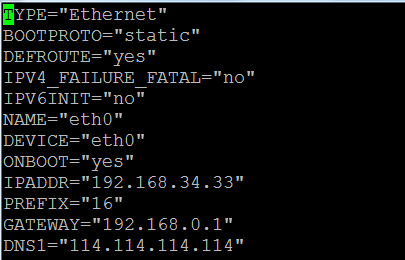
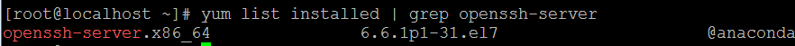
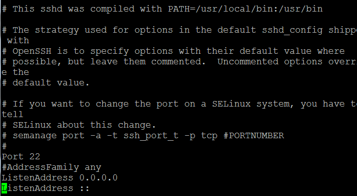
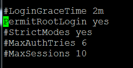
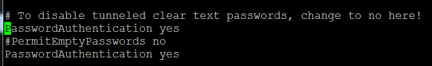
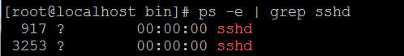
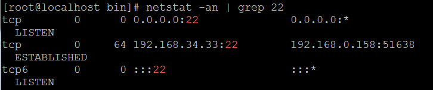

# Centos配置

## 虚拟机安装
1. 所需工具
> CentOS7 iso镜像  
> VMware Workstation  

2. 打开虚拟机新建向导，如图:  

3. 选择稍后安装操作系统，如图:  

4. 选择Linux操作系统，版本选择CentOS64位，如图:  
  
5. 设置虚拟机名称以及安装位置
6. 选择处理器核心数量，默认选择一核，如图:  
  
7. 接下来给虚拟机分配内存，一般1G左右合适，如图:  
  
8. 接下来选择网络类型，选择网络地址转换(NAT)
9. 使用LSI Logic，如图:  
  
10. 继续下一步，如图：  
  
11. 接下来选择创建一个新的虚拟磁盘， 如图：  

12. 选择最大磁盘大小为20G，其余选项如图：  

13. 选择磁盘文件存储位置，点击完成，并且开启此虚拟机
14. 安装过程使用的语言环境，选择英文，如图：  

15. 选择最小化安装系统，不安装图像界面，如图：  

16. 设置root用户以及密码，如图:  

17. 接下来重启系统，完成安装，进入系统。  

## 配置虚拟机网络
1. 使用ifconfig查看，如提示无ifconfig命令，使用yum -y install net-tools.x86_64安装。查询结果如图所示：  

2. vi /etc/sysconfig/network-scripts/ifcfg-eth0修改为:  

3. 重启网络服务：service network restart
>  ONBOOT=yes 设置为开机后启动
>  IPADDR=192.168.34.33 #此处设置固定的IP 
>  GATEWAY=192.168.0.1 #此处设置网关IP 
>  BOOTPROTO=static #设置为静态
  
4. ping www.baidu.com 测试网络是否畅通

## 配置SSH服务
1. 使用yum list installed | grep openssh-server 查看是否安装openssh-server。若未安装，使用yum install openssh-server，安装openssh-server  

2. vi /etc/ssh/sshd_config进行文件编辑
3. 把监听端口、监听地址前的#号去除,如图：  

4. 开启允许远程登陆，去除PermitRootLogin的#号,如图:  

5. 开启使用用户名密码来作为连接验证，去除PasswordActhentication的#，如图：

6. service sshd start 开启服务
7. ps -e | grep sshd 检查是否启动  

8. netstat -an | grep 22 检查端口

